# Model Surgeon -- Requirements Document

## Overview

Model Surgeon is a VS Code extension for visualizing, comparing, and surgically modifying neural network models stored in the safetensors format. It provides an interactive graph-based UI for exploring model architecture, a side-by-side comparison mode for identifying weight differences and LoRA adapter presence, and a set of surgery tools for restructuring models -- all without leaving the editor.

## Terminology

| Term | Definition |
|------|-----------|
| **Tensor** | A named multi-dimensional array of weights stored in a safetensors file. |
| **Component** | A logical grouping of tensors that form a functional unit (e.g., `layers.0.self_attn`). |
| **Block** | A top-level repeating structure in a model (e.g., a transformer layer). |
| **LoRA adapter** | A pair of low-rank matrices (`lora_A`, `lora_B`) that modify a base weight via `W' = W + B @ A`. |
| **Sharded model** | A model split across multiple safetensors files, indexed by `model.safetensors.index.json`. |
| **Surgery** | Any mutation to the model's tensor map: renaming, removing, or replacing tensors. |
| **Drop-in compatible** | Two components whose weight tensors have identical shapes and dtypes, making them interchangeable. |

## Priority Levels

| Level | Meaning |
|-------|---------|
| **P0** | Must-have for initial release. The extension is non-functional without it. |
| **P1** | Important for a usable product. Should ship in v1.0 but could be deferred briefly. |
| **P2** | Nice-to-have. Enhances the experience but the extension is complete without it. |

---

## R1xx: Core Infrastructure

### R100 -- VS Code Extension Scaffold

**Description:** Initialize the extension project with TypeScript, a webview entry point, activation events, and the `package.json` contribution points required for commands and file associations.

**Acceptance Criteria:**
- Extension activates on the command `modelSurgeon.openModel` and when opening `.safetensors` files.
- `package.json` declares `engines.vscode` compatibility, activation events, and contributes commands.
- Project builds with a single `npm run build` command and produces a `.vsix` package with `vsce package`.
- ESLint and Prettier are configured for the codebase.

**Dependencies:** None

**Priority:** P0

---

### R101 -- Safetensors Header Parser

**Description:** Implement a TypeScript module that reads a safetensors file and extracts the JSON header without loading tensor data into memory. The parser must handle the binary format: 8-byte little-endian uint64 header length, followed by the UTF-8 JSON header, followed by raw tensor bytes.

**Acceptance Criteria:**
- Given a path to a `.safetensors` file, returns a typed object containing: `metadata` (key-value string map), and a `tensors` map of `{ [name: string]: { dtype: string; shape: number[]; dataOffsets: [number, number] } }`.
- Reads only the first `8 + headerLength` bytes from disk (no tensor data loaded).
- Rejects files with header size exceeding 100 MB (DoS guard).
- Supports all safetensors dtypes: `F64`, `F32`, `F16`, `BF16`, `I64`, `I32`, `I16`, `I8`, `U8`, `BOOL`, `F8_E4M3`, `F8_E5M2`.
- Unit tests cover: valid single-file model, invalid header, oversized header, empty tensor list.

**Dependencies:** None

**Priority:** P0

---

### R102 -- Lazy Tensor Data Reader

**Description:** Implement a reader that, given a parsed header and a tensor name, reads exactly that tensor's bytes from disk using the `dataOffsets` and the header size. This enables on-demand access without loading the entire file.

**Acceptance Criteria:**
- Reads `end - start` bytes starting at file offset `8 + headerLength + start`.
- Returns a `Buffer` containing the raw tensor bytes.
- Uses `fs.read()` with explicit offset/length (not `fs.readFile()`).
- Handles files opened via `vscode.Uri` (workspace filesystem) and raw `fs` paths.
- Performance: reads a single tensor from a 14 GB file in under 100 ms on SSD.

**Dependencies:** R101

**Priority:** P0

---

### R103 -- Sharded Model Support

**Description:** Detect and transparently handle models sharded across multiple safetensors files. Parse the `model.safetensors.index.json` index file to build a unified tensor map that maps each tensor name to its shard file and offsets.

**Acceptance Criteria:**
- Auto-detects sharded models when the user opens any shard file or the index JSON.
- Builds a unified `TensorMap` identical in shape to a single-file parse result, but with an additional `shardFile` field per tensor.
- Lazy tensor reads (R102) route to the correct shard file.
- Gracefully errors if a referenced shard file is missing from disk.
- Unit tests cover: 3-shard model, missing shard, single-file model (no index).

**Dependencies:** R101, R102

**Priority:** P0

---

### R104 -- LoRA Adapter Detection

**Description:** Given a parsed tensor map, identify which tensors are LoRA adapter weights and associate each `lora_A` / `lora_B` pair with its base tensor. Also detect and parse `adapter_config.json` if present alongside the safetensors files.

**Acceptance Criteria:**
- Identifies tensors matching the pattern `*.lora_A.weight` and `*.lora_B.weight`.
- Groups each A/B pair and resolves the base tensor name by stripping the `lora_A`/`lora_B` suffix and any PEFT prefix (`base_model.model.`).
- Parses `adapter_config.json` for rank (`r`), alpha (`lora_alpha`), target modules, and dropout.
- Returns a typed `LoraAdapterMap` linking base tensor names to their adapter info (rank, alpha, A shape, B shape).
- Handles models with no LoRA adapters (returns empty map).
- Handles models where LoRA adapters are in a separate directory from the base model.

**Dependencies:** R101

**Priority:** P0

---

### R105 -- Model Architecture Tree Builder

**Description:** Transform a flat tensor map into a hierarchical tree representing the model's architecture. Parse dot-separated tensor names (e.g., `model.layers.0.self_attn.q_proj.weight`) into a nested structure of blocks, components, and parameters.

**Acceptance Criteria:**
- Produces a tree where each node has: `name`, `fullPath`, `type` (one of `root`, `block`, `component`, `parameter`), `children`, and optional `tensorInfo` (dtype, shape) for leaf nodes.
- Numbered segments (e.g., `layers.0`, `layers.1`) are recognized as indexed children of a repeating block.
- LoRA adapter tensors (from R104) are attached to their parent component as a special `adapters` field rather than as separate children.
- The tree is deterministically ordered: blocks by index, other children alphabetically.
- Unit tests cover: LLaMA-style naming, GPT-style naming (`h.0.attn`), models with and without LoRA.

**Dependencies:** R101, R104

**Priority:** P0

---

### R106 -- Worker Thread Infrastructure

**Description:** Set up a Node.js `worker_threads` pool for offloading CPU-intensive operations (tensor comparison, file serialization) off the extension host thread.

**Acceptance Criteria:**
- A `WorkerPool` class manages a configurable number of workers (default: 2).
- Exposes an `execute(taskType, payload): Promise<result>` API.
- Workers are lazily spawned and reused across calls.
- Workers are terminated when the extension deactivates.
- Errors in workers are caught and surfaced as rejected promises with stack traces.

**Dependencies:** R100

**Priority:** P1

---

### R107 -- Webview / Extension Host Message Protocol

**Description:** Define a typed, versioned message protocol for communication between the extension host and the React webview. All messages must be JSON-serializable.

**Acceptance Criteria:**
- A shared TypeScript types file defines all message types as a discriminated union on a `type` field.
- Messages are versioned with a `protocolVersion` number to guard against stale webviews.
- The extension host exposes a `postMessage` wrapper that validates outgoing messages against the type schema.
- The webview exposes a `useMessage` React hook that subscribes to incoming messages and dispatches to handlers.
- Message types cover at minimum: `loadModel`, `modelLoaded`, `loadComparison`, `comparisonResult`, `performSurgery`, `surgeryResult`, `error`, `progress`.

**Dependencies:** R100

**Priority:** P0

---

## R2xx: Model Visualization

### R200 -- React Flow Graph Renderer

**Description:** Render the model architecture tree (R105) as an interactive node graph in the webview using React Flow. Each block, component, and parameter maps to a styled node, with edges representing containment and data flow.

**Acceptance Criteria:**
- Blocks (e.g., transformer layers) render as large container nodes with a header showing the block name and index.
- Components (e.g., `self_attn`, `mlp`) render as medium nodes inside their parent block.
- Parameter nodes (leaves) render as compact chips showing tensor name, dtype badge, and shape.
- Edges connect components in data-flow order where inferable (embedding -> layers -> norm -> lm_head).
- The graph supports pan, zoom, and box selection out of the box via React Flow.
- Initial layout is computed automatically (top-to-bottom hierarchical layout).

**Dependencies:** R100, R105, R107

**Priority:** P0

---

### R201 -- Collapsible Block Groups

**Description:** Allow users to collapse and expand blocks and components in the graph to manage visual complexity. A model with 80 transformer layers should be navigable without overwhelming the viewport.

**Acceptance Criteria:**
- Double-clicking a block node toggles collapse/expand.
- Collapsed blocks show a summary: block name, layer count or range (e.g., "layers 0-31"), total parameter count.
- A "Collapse All / Expand All" toolbar button is available.
- A layer range selector allows expanding a subset (e.g., layers 10-15) while keeping others collapsed.
- Collapse state is preserved across pan/zoom operations.

**Dependencies:** R200

**Priority:** P0

---

### R202 -- Tensor Detail Panel

**Description:** When a user clicks a parameter node, display a detail side panel showing full tensor metadata and optional weight statistics.

**Acceptance Criteria:**
- Panel shows: full tensor name, dtype, shape, size in bytes, size in human-readable format (MB/GB).
- If the tensor has an associated LoRA adapter (R104), the panel shows: adapter rank, alpha, A/B shapes, and scaled contribution factor (`alpha / r`).
- A "Load Statistics" button triggers lazy loading (R102) of the tensor data and computes: min, max, mean, std, L2 norm, sparsity (% zeros). These are computed in a worker thread (R106).
- Statistics are cached after first load for the duration of the session.

**Dependencies:** R102, R104, R106, R200

**Priority:** P1

---

### R203 -- Search and Filter

**Description:** Provide a search bar that filters the graph to highlight or isolate tensors matching a query.

**Acceptance Criteria:**
- Text search matches against tensor full paths (substring, case-insensitive).
- Filter mode options: "Highlight" (dims non-matching nodes) or "Isolate" (hides non-matching nodes).
- Filter by dtype dropdown (e.g., show only BF16 tensors).
- Filter by "has LoRA adapter" toggle.
- Pressing Escape clears the filter and restores the full view.
- Search field is keyboard-accessible via `Ctrl+F` / `Cmd+F` within the webview.

**Dependencies:** R200, R104

**Priority:** P1

---

### R204 -- Minimap and Navigation

**Description:** Provide a minimap and navigation aids for large models.

**Acceptance Criteria:**
- React Flow's built-in MiniMap component is enabled and styled to match VS Code theme colors.
- A "Fit to View" button resets zoom/pan to show the entire graph.
- A "Jump to Layer" dropdown allows direct navigation to any block by index.
- Keyboard navigation: arrow keys to move between sibling nodes, Enter to expand/collapse.

**Dependencies:** R200

**Priority:** P2

---

### R205 -- LoRA Adapter Visualization

**Description:** Visually distinguish tensors that have LoRA adapters attached from plain base-weight tensors.

**Acceptance Criteria:**
- Parameter nodes with a LoRA adapter display a distinct visual indicator (colored ring or badge) that is clearly differentiated from nodes without adapters.
- The indicator color and style are consistent and documented in a legend accessible from the toolbar.
- Hovering the indicator shows a tooltip with adapter rank and alpha.
- Components where all child parameters have LoRA adapters show an aggregate indicator on the component node.

**Dependencies:** R104, R200

**Priority:** P0

---

## R3xx: Model Comparison

### R300 -- Dual Model Loading

**Description:** Allow the user to load two models simultaneously for comparison. The second model is loaded via a command or drag-and-drop.

**Acceptance Criteria:**
- Command `modelSurgeon.openComparison` prompts for a second model file/directory after a first model is loaded.
- Both models' headers are parsed and their architecture trees are built independently.
- If both models are sharded, both index files are resolved correctly.
- The extension host holds both parsed models in memory simultaneously.
- Loading the second model does not block the UI; a progress indicator is shown.

**Dependencies:** R101, R103, R105

**Priority:** P0

---

### R301 -- Architecture Alignment

**Description:** Given two parsed model trees, compute an alignment that matches components from Model A to components in Model B by their full path. Identify components present in only one model.

**Acceptance Criteria:**
- Matching is performed on the canonical tensor path (after stripping known prefixes like `base_model.model.`).
- The result classifies every component as: `matched` (present in both), `onlyA`, or `onlyB`.
- For `matched` components, shape compatibility is checked: tensors with identical names but different shapes are flagged as `shapeMismatch`.
- The alignment is computed in under 1 second for models with up to 100,000 tensors.

**Dependencies:** R105

**Priority:** P0

---

### R302 -- Weight Difference Computation

**Description:** For aligned (matched) tensor pairs, compute difference metrics to quantify how much the weights have changed. This requires lazy-loading both tensors' data.

**Acceptance Criteria:**
- Metrics computed per tensor pair: cosine similarity, L2 norm of difference, max absolute difference, mean absolute difference.
- Computation runs in a worker thread (R106) to avoid blocking the UI.
- A progress bar in the webview updates as tensor pairs are processed.
- Results are cached per tensor pair for the duration of the session.
- The user can choose to compute metrics for: all tensors, a selected block, or a single tensor.
- Handles dtype mismatches gracefully: if dtypes differ, both tensors are upcast to F32 before comparison.

**Dependencies:** R102, R106, R301

**Priority:** P0

---

### R303 -- Comparison Graph View

**Description:** Render a side-by-side or overlaid graph view showing both models with difference annotations.

**Acceptance Criteria:**
- Side-by-side mode: Model A on the left, Model B on the right, with connecting lines between matched components.
- Overlay mode: single graph where each node shows both models' data, color-coded.
- Nodes are color-coded by difference magnitude: a gradient from green (identical / cosine sim ~1.0) through yellow to red (highly different / cosine sim < 0.5).
- Components present in only one model are shown with a distinct "absent" styling (dashed border, muted color).
- Shape-mismatched components are shown with a warning icon.
- The color scale and thresholds are shown in a legend and are user-configurable.

**Dependencies:** R200, R301, R302

**Priority:** P0

---

### R304 -- LoRA Presence Differentiation

**Description:** In comparison view, clearly indicate when one model has a LoRA adapter on a component and the other does not, and when both have adapters but with different configurations.

**Acceptance Criteria:**
- A dedicated visual state for "LoRA on A only", "LoRA on B only", "LoRA on both (same config)", "LoRA on both (different config)".
- Each state uses a distinct, colorblind-accessible icon or badge combination.
- The comparison detail panel (R305) lists adapter config differences (rank, alpha, target modules).
- When base weights are identical but LoRA presence differs, the node is styled to emphasize that the difference is purely adapter-based, not a weight change.

**Dependencies:** R104, R301, R303

**Priority:** P0

---

### R305 -- Comparison Detail Panel

**Description:** When a user clicks a node in comparison view, show a detail panel with per-tensor diff information for that component.

**Acceptance Criteria:**
- Lists every tensor in the component with: name, shape (both models if mismatched), dtype (both if mismatched), and all computed diff metrics (R302).
- For LoRA-differentiated components (R304), shows a structured comparison of adapter configs.
- A "Load Full Diff" button triggers on-demand computation for tensors not yet compared.
- Diff metrics are displayed with contextual formatting: cosine similarity as a percentage bar, norms as numeric values.

**Dependencies:** R202, R302, R304

**Priority:** P1

---

## R4xx: Model Surgery

### R400 -- Surgery Session and Undo Stack

**Description:** Implement a surgery session that tracks all mutations as an ordered list of operations, supporting undo/redo. No changes are written to disk until an explicit save (R500).

**Acceptance Criteria:**
- A `SurgerySession` object holds a reference to the original parsed model and a stack of operations.
- Supported operation types: `renameTensor`, `removeTensor`, `replaceTensor`, `renameLoraAdapter`, `removeLoraAdapter`.
- Each operation stores enough state to be fully reversible.
- Undo (`Ctrl+Z` / `Cmd+Z` in webview) and Redo (`Ctrl+Shift+Z` / `Cmd+Shift+Z`) navigate the stack.
- The webview graph updates reactively after each operation.
- A "Pending Changes" badge in the toolbar shows the count of unapplied operations.

**Dependencies:** R105, R107

**Priority:** P0

---

### R401 -- Rename Component

**Description:** Allow the user to rename a component (any non-leaf node in the architecture tree), which batch-renames all descendant tensors.

**Acceptance Criteria:**
- Right-clicking a component node shows a "Rename" context menu item.
- A text input dialog pre-fills the current name segment; the user edits it.
- All descendant tensors have their paths updated to reflect the new name segment.
- Renaming validates that the new name does not collide with an existing sibling.
- The operation is recorded in the surgery session (R400) and is undoable.
- The graph re-renders with the updated names immediately.

**Dependencies:** R400, R200

**Priority:** P0

---

### R402 -- Remove LoRA Adapter

**Description:** Allow the user to remove a LoRA adapter from a component, leaving only the base weight.

**Acceptance Criteria:**
- Right-clicking a component with a LoRA adapter shows "Remove LoRA Adapter".
- Removal deletes the `lora_A` and `lora_B` tensors from the tensor map.
- The component's visual indicator (R205) updates to show no adapter.
- If adapter_config.json metadata was loaded, the removal is reflected in the session's modified metadata.
- The operation is recorded in the surgery session (R400) and is undoable.

**Dependencies:** R400, R104, R205

**Priority:** P0

---

### R403 -- Rename LoRA Adapter

**Description:** Allow the user to rename the LoRA adapter key prefix on a component or set of components.

**Acceptance Criteria:**
- Right-clicking a LoRA-bearing component shows "Rename LoRA Adapter".
- The user provides a new adapter name; the `lora_A` and `lora_B` tensor paths are updated accordingly.
- Batch rename is supported: the user can select multiple components and rename all their adapters at once.
- Validates that the new name does not collide with existing tensor paths.
- The operation is recorded in the surgery session (R400) and is undoable.

**Dependencies:** R400, R104

**Priority:** P0

---

### R404 -- Replace Component (Cross-Model Surgery)

**Description:** In comparison mode with two models loaded, allow the user to replace a component in Model A with the drop-in compatible equivalent from Model B.

**Acceptance Criteria:**
- The context menu for a `matched` component (R301) in the comparison view shows "Replace with Model B's version" (and vice versa).
- The option is only enabled when all tensors in the component are drop-in compatible: same names (relative to component root), same shapes, and same dtypes.
- Replacing copies the tensor data references from Model B into Model A's surgery session.
- The comparison view updates: the replaced component's diff metrics become zero (identical).
- Incompatible components show a disabled menu item with a tooltip explaining the incompatibility (e.g., "Shape mismatch: [4096, 4096] vs [4096, 2048]").
- The operation is recorded in the surgery session (R400) and is undoable.

**Dependencies:** R400, R301, R303

**Priority:** P0

---

### R405 -- Surgery Preview

**Description:** Before saving, show the user a summary of all pending surgery operations and their effects.

**Acceptance Criteria:**
- A "Review Changes" panel lists all operations in order with: operation type, target component, before/after state.
- Operations can be individually removed (reverted) from the list.
- A "Diff Summary" shows: number of tensors renamed, removed, replaced; total data size delta.
- The panel is accessible from the "Pending Changes" badge (R400).

**Dependencies:** R400

**Priority:** P1

---

## R5xx: Export / Save

### R500 -- Safetensors Serializer

**Description:** Implement a TypeScript module that writes a complete safetensors file from an in-memory tensor map. This is the inverse of R101/R102.

**Acceptance Criteria:**
- Accepts a `TensorMap` (names, dtypes, shapes, and raw `Buffer` data per tensor) and optional metadata.
- Writes: 8-byte LE header length, JSON header, contiguous tensor data.
- Tensors are written in alphabetical order by name (matching the convention of the reference Python implementation).
- Data offsets in the header are correct and contiguous (no gaps).
- The output file is byte-compatible with the `safetensors` Python library: `safetensors.torch.load_file()` can load the output without error.
- Unit tests verify round-trip: parse a file (R101), serialize it (R500), parse again, and confirm the headers and tensor data are identical.

**Dependencies:** R101

**Priority:** P0

---

### R501 -- Save Surgery Result

**Description:** Apply all pending surgery operations to produce a new safetensors file (or set of sharded files) and write it to disk.

**Acceptance Criteria:**
- The user triggers save via command `modelSurgeon.saveSurgeryResult` or toolbar button.
- A file picker dialog prompts for the output path; defaults to `<original_name>_modified.safetensors` in the same directory.
- For replaced components (R404), the actual tensor bytes are read from Model B's file(s) on demand.
- For renamed tensors, only the header metadata changes; data bytes are copied as-is.
- For removed tensors, the data is omitted.
- If the original model was sharded, the output is written as a single file by default, with an option to preserve sharding.
- A progress bar shows write progress (percentage of total bytes written).
- The output file is verified by re-parsing its header and confirming tensor count and names.

**Dependencies:** R400, R500, R102

**Priority:** P0

---

### R502 -- Metadata Preservation

**Description:** Preserve or update the `__metadata__` section of the safetensors header during save.

**Acceptance Criteria:**
- The original metadata key-value pairs are carried over to the output file.
- A `model_surgeon.operations` metadata key is added summarizing the surgery performed (JSON-encoded list of operation types and targets).
- A `model_surgeon.source` metadata key records the original file path(s).
- The user can opt out of adding Model Surgeon metadata via a setting.

**Dependencies:** R500

**Priority:** P2

---

## R6xx: UX / Polish

### R600 -- VS Code Theme Integration

**Description:** Style the entire webview UI to match the user's active VS Code color theme.

**Acceptance Criteria:**
- All UI elements use VS Code CSS custom properties (`--vscode-editor-foreground`, `--vscode-editor-background`, etc.).
- The UI renders correctly in light, dark, and high-contrast themes.
- React Flow node and edge colors derive from theme tokens, not hardcoded values.
- Diff-related colors (green/yellow/red gradient in R303) remain legible in all three theme categories.
- A manual test checklist covers all three themes.

**Dependencies:** R200

**Priority:** P1

---

### R601 -- Performance Budget

**Description:** Define and enforce performance targets so the extension remains responsive with large models.

**Acceptance Criteria:**
- Header parsing (R101) for a 14 GB single-file model completes in under 500 ms.
- Architecture tree construction (R105) for 100,000 tensors completes in under 1 second.
- Initial graph render (R200) for a 70B model (with blocks collapsed) achieves 60 fps after layout is complete.
- Tensor comparison (R302) for a single tensor pair up to 1 GB completes in under 5 seconds in a worker thread.
- File save (R501) writes at disk I/O speed (verified to be within 2x of raw `fs.copyFile` baseline).
- A CI performance test suite runs against synthetic models of 1K, 10K, and 100K tensors.

**Dependencies:** R101, R105, R200, R302, R501

**Priority:** P1

---

### R602 -- Error Handling and User Feedback

**Description:** All errors surface as user-friendly messages; no silent failures.

**Acceptance Criteria:**
- File I/O errors (missing file, permission denied, corrupt header) show a VS Code error notification with the file path and cause.
- Surgery validation errors (name collision, shape incompatibility) show an inline warning in the webview near the relevant node.
- Worker thread crashes are caught, logged, and reported to the user with a "Retry" option.
- A VS Code output channel `Model Surgeon` logs all operations and errors with timestamps for debugging.
- Progress indicators (loading, comparing, saving) show determinate progress bars where possible and indeterminate spinners otherwise.

**Dependencies:** R100, R107

**Priority:** P1

---

### R603 -- Accessibility

**Description:** The webview UI meets WCAG 2.1 AA standards for keyboard navigation and screen reader compatibility.

**Acceptance Criteria:**
- All interactive elements are keyboard-reachable via Tab and activatable via Enter/Space.
- ARIA labels are set on all graph nodes with meaningful descriptions (e.g., "Transformer layer 0, self-attention, query projection, shape 4096 by 4096, BFloat16").
- Color is never the sole indicator of state; all diff and LoRA states also use icons or text labels.
- Focus indicators are visible in all themes.
- The diff color gradient (R303) passes WCAG contrast ratio against the background in all themes.

**Dependencies:** R200, R303

**Priority:** P2

---

### R604 -- Onboarding and Help

**Description:** Provide first-run guidance and in-context help.

**Acceptance Criteria:**
- On first activation, a welcome view explains the extension's purpose and shows a "Get Started" walkthrough.
- Toolbar includes a "?" help button that opens a quick-reference overlay showing: keyboard shortcuts, node color legend, surgery workflow.
- Context menu items have descriptive tooltips.
- The extension contributes a VS Code walkthrough (`walkthroughs` contribution point) with 3-4 steps covering: load a model, compare models, perform surgery, save result.

**Dependencies:** R100, R200

**Priority:** P2

---

## R7xx: Packaging and Marketplace

### R700 -- Extension Metadata

**Description:** Complete all VS Code Marketplace metadata for a polished listing.

**Acceptance Criteria:**
- `package.json` includes: `displayName`, `description`, `publisher`, `version`, `icon`, `galleryBanner`, `categories` (["Machine Learning", "Visualization"]), `keywords`, `repository`, `license`.
- An icon (128x128 PNG) is designed and included.
- `README.md` in the repo root serves as the Marketplace page: includes feature screenshots/GIFs, installation instructions, usage guide, and keyboard shortcut table.
- `CHANGELOG.md` is initialized with the v1.0.0 entry.

**Dependencies:** R100

**Priority:** P0

---

### R701 -- CI / CD Pipeline

**Description:** Automate build, test, and packaging in a GitHub Actions workflow.

**Acceptance Criteria:**
- On every push and PR: lint, type-check, run unit tests, build extension.
- On tag push (`v*`): build, test, package `.vsix`, create GitHub Release with the `.vsix` as an asset.
- Marketplace publish step (`vsce publish`) is available as a manual workflow dispatch.
- Build matrix covers Node.js LTS versions (18, 20).

**Dependencies:** R100

**Priority:** P1

---

### R702 -- Extension Size Budget

**Description:** Keep the packaged extension small and fast to install.

**Acceptance Criteria:**
- The `.vsix` file is under 5 MB (excluding bundled test fixtures).
- Webview assets (JS, CSS) are bundled and minified (webpack or esbuild).
- No unnecessary runtime dependencies are included (tree-shaking enabled).
- `node_modules` is not shipped; all code is bundled.

**Dependencies:** R100, R200

**Priority:** P1

---

## Dependency Graph

```mermaid
graph TD
    R100[R100 Extension Scaffold]
    R101[R101 Header Parser]
    R102[R102 Lazy Tensor Reader]
    R103[R103 Sharded Model Support]
    R104[R104 LoRA Detection]
    R105[R105 Architecture Tree Builder]
    R106[R106 Worker Thread Pool]
    R107[R107 Message Protocol]

    R200[R200 Graph Renderer]
    R201[R201 Collapsible Blocks]
    R202[R202 Tensor Detail Panel]
    R203[R203 Search and Filter]
    R204[R204 Minimap]
    R205[R205 LoRA Visualization]

    R300[R300 Dual Model Loading]
    R301[R301 Architecture Alignment]
    R302[R302 Weight Diff Computation]
    R303[R303 Comparison Graph View]
    R304[R304 LoRA Differentiation]
    R305[R305 Comparison Detail Panel]

    R400[R400 Surgery Session]
    R401[R401 Rename Component]
    R402[R402 Remove LoRA Adapter]
    R403[R403 Rename LoRA Adapter]
    R404[R404 Replace Component]
    R405[R405 Surgery Preview]

    R500[R500 Safetensors Serializer]
    R501[R501 Save Surgery Result]
    R502[R502 Metadata Preservation]

    R600[R600 Theme Integration]
    R601[R601 Performance Budget]
    R602[R602 Error Handling]
    R603[R603 Accessibility]
    R604[R604 Onboarding]

    R700[R700 Extension Metadata]
    R701[R701 CI/CD Pipeline]
    R702[R702 Size Budget]

    R102 --> R101
    R103 --> R101
    R103 --> R102
    R104 --> R101
    R105 --> R101
    R105 --> R104
    R106 --> R100
    R107 --> R100

    R200 --> R100
    R200 --> R105
    R200 --> R107
    R201 --> R200
    R202 --> R102
    R202 --> R104
    R202 --> R106
    R202 --> R200
    R203 --> R200
    R203 --> R104
    R204 --> R200
    R205 --> R104
    R205 --> R200

    R300 --> R101
    R300 --> R103
    R300 --> R105
    R301 --> R105
    R302 --> R102
    R302 --> R106
    R302 --> R301
    R303 --> R200
    R303 --> R301
    R303 --> R302
    R304 --> R104
    R304 --> R301
    R304 --> R303
    R305 --> R202
    R305 --> R302
    R305 --> R304

    R400 --> R105
    R400 --> R107
    R401 --> R400
    R401 --> R200
    R402 --> R400
    R402 --> R104
    R402 --> R205
    R403 --> R400
    R403 --> R104
    R404 --> R400
    R404 --> R301
    R404 --> R303
    R405 --> R400

    R500 --> R101
    R501 --> R400
    R501 --> R500
    R501 --> R102
    R502 --> R500

    R600 --> R200
    R601 --> R101
    R601 --> R105
    R601 --> R200
    R601 --> R302
    R601 --> R501
    R602 --> R100
    R602 --> R107
    R603 --> R200
    R603 --> R303
    R604 --> R100
    R604 --> R200

    R700 --> R100
    R701 --> R100
    R702 --> R100
    R702 --> R200
```

## Implementation Order (Suggested)

Based on the dependency graph, the recommended build order is:

1. **Phase 1 -- Foundation:** R100, R101, R104, R107
2. **Phase 2 -- File I/O:** R102, R103, R105, R106
3. **Phase 3 -- Single-Model Viz:** R200, R201, R205, R203
4. **Phase 4 -- Comparison:** R300, R301, R302, R303, R304
5. **Phase 5 -- Surgery:** R400, R401, R402, R403, R404
6. **Phase 6 -- Save:** R500, R501
7. **Phase 7 -- Polish:** R202, R204, R305, R405, R600, R601, R602, R603, R604, R502
8. **Phase 8 -- Ship:** R700, R701, R702
